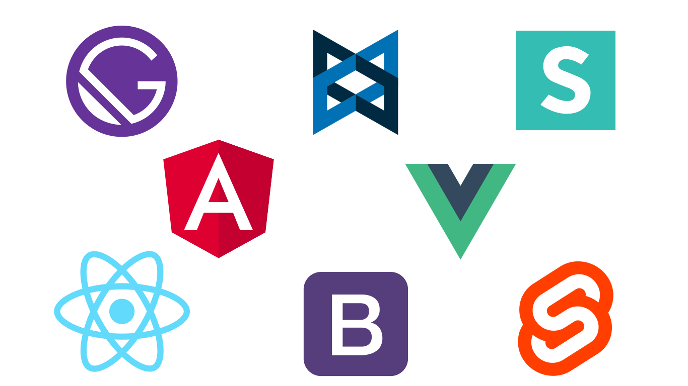

# create-chrome-extension


## Build Create Chrome Extension Template

Node JS CLI tool that auto generates the necessary files for your chrome extension in your <strong>favourite framework</strong>.


## Integrations



## How to use
```
npx create-chrome-extension
```

## Contributing
Interested in contributing to this project? You can log any issues or suggestion related to this library <a href="https://github.com/M2KDevelopments/create-chrome-extensionr/issues/new">here</a>

Read our contributing guide on getting started with contributing to the codebase


## Support

<a href="https://www.buymeacoffee.com/m2kdevelopments" target="_blank">

</a>

